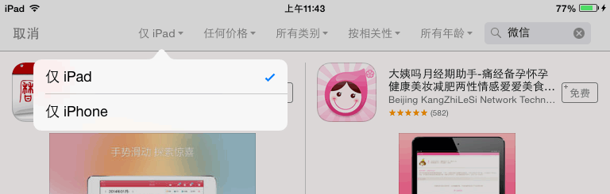

客户 FAQ
=====

目录
----
* [你们开发都适配那些设备？](#你们开发都适配那些设备)
* [如何查看设备 UDID？](#如何查看设备-udid)
* [如何查看设备上 iOS 系统的版本？](#如何查看设备上-ios-系统的版本)
* [收到了安装链接，如何使用？](#收到了安装链接如何使用)
* [收到了发来的应用包（IPA 格式），如何安装？](#收到了发来的应用包ipa-格式如何安装)
* [如何申请开发者账号？](#如何申请开发者账号)
* [应用送审需要提供那些信息？](#应用送审需要提供那些信息)
* [应用审核需要多长时间？](#应用审核需要多长时间)
* [应用上线了，但在商店里搜不到我的应用？](#应用上线了但在商店里搜不到我的应用)

你们开发都适配那些设备？
-----
除了专门针对 iPad 开发的应用，应用能运行在绝大多数 iPhone、iPod Touch 和 iPad 上。对于 iPhone 应用，如果没有要求为 iPad 做专门的适配，应用将会以小窗口的形式运行在 iPad 上。

另外需要注意的是，应用只能运行在特定版本的 iOS 系统上。如无特殊约定，对于新开发的应用，我们只支持 Apple 最新发布的两个大版本，举例来说，iOS 8 发布后，我们将只支持 iOS 7 和 iOS 8，iOS 6 及更早版本将不再支持。

这是因为 Apple 的开发工具 Xcode 能支持 iOS 系统是和其版本是绑定的，如果要支持新系统，就要用新版本的 Xcode，但新版本的 Xcode 又没有旧版本的模拟器，我们的测试设备又不能每个版本都留，肯定要优先保证新的系统；而且高版本的项目文件很可能在低版本开发工具上打不开，所以要支持两个以上的 iOS 版本非常麻烦。对于旧版本应用的维护，我们可以添加对新系统的支持，是否维持对旧版本的支持，需要另行讨论。

不必太过担心，当有新系统发布后，用户升级的速度还是很快的，Apple 官方会定期发布 iOS 各版本份额的数据，您可以到 https://developer.apple.com/support/appstore/ 查看。

如果您仍认为有兼容旧系统的必要，请提前确认，以免后期导致不必要的麻烦。

[⇡ 回顶部](#目录)

如何查看设备 UDID？
-----

### 方法一，在线查看

在设备上打开浏览器，访问 http://udid.io 或扫描下面二维码，然后按提示操作：

### 方法二，使用 iTunes

如果电脑上没有安装 iTunes，你需要先下载安装 iTunes。

连接设备，显示设备信息，如下所示：

在序列号区域点击，会切换成 UDID，右键可以复制：

[⇡ 回顶部](#目录)

如何查看设备上 iOS 系统的版本？
-----
参见： http://support.apple.com/kb/HT2188?viewlocale=zh_CN

[⇡ 回顶部](#目录)

收到了安装链接，如何使用？
-----
在发送测试版本时，你可能会收到一个形如 http://is.gd/apptest 这样的链接，请在 iPhone 或 iPad 上打开这个链接（而不是电脑上），系统会弹出提示询问是否安装。点击确定，系统会自行下载安装。

[⇡ 回顶部](#目录)

收到了发来的应用包（IPA 格式），如何安装？
-----
iTunes 可以管理设备上的应用，你可以通过 iTunes 把应用程序同步到设备上。

不过 iTunes 不太符合国人的使用习惯，你也可以尝试使用第三方工具，比如 [iTools](http://www.itools.cn/download) 来安装。

[⇡ 回顶部](#目录)

如何申请开发者账号？
-----
如果你不想将应用发布在我们的名下，你需要申请自己的开发者账号。申请过程可能会长达一个月。强烈建议你先阅读 [官方 FAQ](https://developer.apple.com/cn/support/ios/enrollment.html)，注：里面提到的 Volume Purchase Program 在中国不可用。

iOS 开发计划有几类：普通（里面又分个人或组织两个子类）、企业级、高校。你可以在[选择 iOS Developer Program](https://developer.apple.com/cn/programs/start/ios/) 了解到详情。一般来说，如果你的应用不想发布到 App Store，而是通过自己的服务器分发，需要申请 iOS Developer Enterprise Program，否则普通的 iOS Developer Program 就够了。

如果以非个人或高校名义申请，需要有公司的邓氏编码（D-U-N-S Number），可以到 [D-U-N-S Profile Lookup](https://developer.apple.com/ios/enroll/dunsLookupForm.action) 查询或免费申请。申请提交后 Apple 可能会在几个工作日内打来电话确认。如果以个人身份发布应用则不需要这个了。更多信息参见 [Apple 官方 D-U-N-S® Number 问答](https://developer.apple.com/cn/support/ios/D-U-N-S.html)。

准备好后，就可以开始下面的申请了，申请入口：[Apple Developer Programs 注册
](https://developer.apple.com/cn/programs/start/ios/)。参考教程：[13年6月企业 IDP 申请攻略](http://www.cocoachina.com/bbs/simple/?t144852.html)

[⇡ 回顶部](#目录)

应用送审需要提供那些信息？
-----

一般，你需要提供应用名，应用介绍文本，应用分类，版权信息、网站链接等信息。应用截图如果不能单独提供，我们会选择几个典型界面的截图。其他信息我们可以帮填。

如果设计由你们出的话，还需要一个 1024 x 1024 像素的超大应用图标。

所需信息的完整的列表可以见 Apple 网站：[iTunes Connect App Properties](https://developer.apple.com/library/ios/documentation/LanguagesUtilities/Conceptual/iTunesConnect_Guide/Appendices/Properties.html)

**建议**：应用图标、应用截图、应用名、用户评价这几个因素直接会影响到用户是否会下载你的应用，需要认真对待，建议多看看流行应用是怎么做的。相对于这几个，其他信息对用户下载行为影响较弱。建议条件允许的话，应用截图可以找人单独设计，不必一定是实际应用截图。应用标题的建议另参见：[应用上线了，但在商店里搜不到我的应用](#应用上线了但在商店里搜不到我的应用)。

以下是介绍文本，截图，关键字和分类的要求。

### 应用介绍文本

无格式的纯文本，字符限制 10 到 4000。

### 应用截图

应用截图分 iPhone 3.5 寸、iPhone 4 寸和 iPad 三组。如果是 iPad 专用应用，可以只提供 iPad 的，否则需要同时提供 iPhone 3.5 寸 和 iPhone 4 寸至少两组。每组最多能有五张。

截图分辨率有如下要求：

* 3.5 寸截图的可以是 960x640, 960x600, 640x960 或 640x920；
* 4 寸截图的可以是 1136x640, 1136x600, 640x1136 或 640x1096；
* iPad 截图的可以是 1024x768, 1024x748, 768x1024, 768x1004, 2048x1536, 2048x1496, 1536x2048 或 1536x2008。

### 关键字

关键字建议也拟一套，因为可能会影响用户搜索结果。关键字不能超过 100 字符。如不提供我们会考量你的应用功能填写。

### 应用分类

应用的分类可能需要你来决定，因为这会决定用户能在哪个类别列表中找到你的应用。

可选的应用类别大致如下：

* 图书 Book
* 商务 Business
* 商品指南 Catalogs
* 教育 Education
* 娱乐 Entertainment
* 财务 Finance
* 美食佳饮 Food & Drink
* 游戏 Games
* 健康健美 Health & Fitness
* 生活 Lifestyle
* 医疗 Medical
* 音乐 Music
* 导航 Navigation
* 新闻 News
* 摄影与录像 Photo & Video
* 效率 Productivity
* 参考 Reference
* 社交 Social Networking
* 体育 Sports
* 旅游 Travel
* 工具 Utilities
* 天气 Weather
* 儿童 Made for Kids

你可以选一个主类别，一个辅类别。除非是游戏或报刊杂志类，辅类别跟上面的列表一致。

[⇡ 回顶部](#目录)

应用审核需要多长时间？
-----

顺利的话，应用第一次提交最短要 7 天时间，保险点第一次提交应留出两周时间。发布新版本的时间一般是首次提交的一半，但也有较长的。

如果应用涉及支付，而没有使用 Apple 的应用内购买的话，建议至少留出 20 天的余量。

[⇡ 回顶部](#目录)

应用上线了，但在商店里搜不到我的应用？
-----
如果你在 iPad 上搜索只有 iPhone 版本的应用，默认是搜不到的，你需要修改筛选条件以显示 iPhone 版本的应用，如下所示：

对于新上架应用，因为没有什么积累，排名会很不利。我们有一个案例，新上线一个应用就搜名称，但是排名在 16 位开外，在 iPhone 上要往后翻很多页才能看到，客户就奇怪为什么在商店找不到。所以建议初期定名称的时候，先搜索一下看看结果，避免选一个太大路货的名字。

[⇡ 回顶部](#目录)
