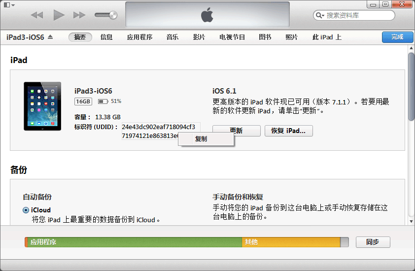

客户 FAQ
=====

目录
----
* [如何查看设备 UDID？](#如何查看设备-udid)
* [如何查看设备的系统版本？](#如何查看设备的系统版本)
* [应用审核需要多长时间？](#应用审核需要多长时间)

如何查看设备 UDID？
-----

### 方法一，在线查看

在设备上打开浏览器，访问 http://udid.io 。或扫描下面二维码：

### 方法二，使用 iTunes

如果电脑上没有安装 iTunes，你需要先下载安装 iTunes。

连接设备，显示设备信息，如下所示：

点击序列号区域，会切换成 UDID，右键可以复制：

[⇡ 回顶部](#目录)

如何查看设备的系统版本？
-----
参见： http://support.apple.com/kb/HT2188?viewlocale=zh_CN

[⇡ 回顶部](#目录)

应用审核需要多长时间？
-----

顺利的话，应用第一次提交最短要 7 天时间，保险点第一次提交应留出两周时间。发布新版本的时间一般是首次提交的一半，但也有较长的。

如果应用涉及支付，而没有使用 Apple 的应用内购买的话，建议至少留出 20 天的余量。

[⇡ 回顶部](#目录)
