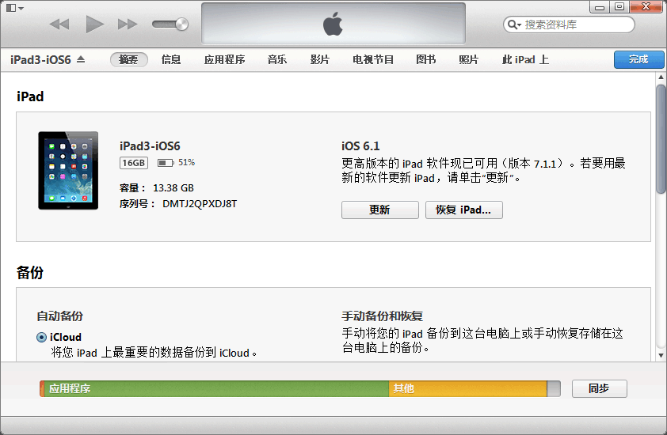

客户 FAQ
=====

目录
----
* [如何查看设备 UDID？](#如何查看设备-udid)

如何查看设备 UDID？
-----

### 方法一，在线查看

在设备上打开浏览器，访问 http://udid.io 。或扫描下面二维码：

### 方法二，使用 iTunes

如果电脑上没有安装 iTunes，你需要先下载安装 iTunes。

连接设备，显示设备信息，如下所示：

点击序列号区域，会切换成 UDID，右键可以复制：

[⇡ 回顶部](#目录)
